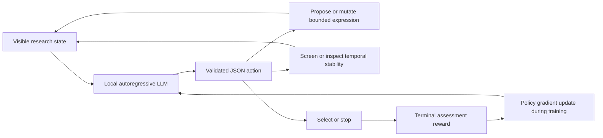
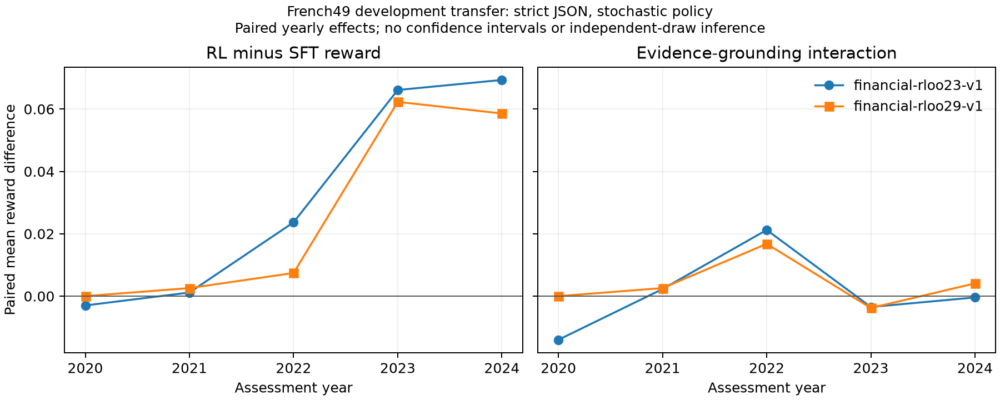

# AlphaResearch-RL

**An inspectable environment for training language models to conduct sequential factor research.**

An actor proposes a bounded factor expression, spends a finite budget on evidence,
revises or selects candidates, and receives a later-period research reward.
The project separates the research process from the financial prediction task so
that leakage, invalid actions, reward design, and actual parameter updates can be
tested independently.

**Status: measured research prototype, with mixed and negative results.**
Local Qwen3-0.6B LoRA training, saved-model checks, and chronological financial
comparisons have run. In the financial proposal study, two RL runs improved the
declared reward over SFT, but most of the gain came from fewer invalid formulas;
neither sampled policy beat the uniform formula-grid reference. Correct-feedback effects were
inconsistent across seeds. These results do not establish a useful financial
alpha or a learned full research agent.

| Completed study | Evidence | Main result |
| --- | --- | --- |
| Sequential synthetic pilot | SFT and trajectory RLOO, six development tasks | Identical SFT/RL greedy actions and rewards; no incremental RL benefit |
| Constructed feedback curriculum | 384 updates, 24 held-out paired interventions | 8/24 pairs correct; the predeclared 80% gate failed |
| Financial formula proposal | 96 SFT and 31 RL updates; two RL seeds, ten 2020–2024 half-years | Reward gains +.03146 / +.02618 over SFT; +.025 in each comes from reduced failure penalties |
| Numerical financial baseline | Fixed walk-forward ridge on French49 | IC .01759; descriptive block interval includes zero |

Start with the [financial results](docs/financial-proposal-results-v1.md),
[reproduction commands](docs/reproduce-financial-study.md), and
[independent training audit](docs/audits/2026-10-01-financial-training-evidence.md).
The [original results](docs/results-v1.md) and
[failed curriculum gate](docs/curriculum-results-v2.md) remain available.
The financial proposal experiment is a one-action contextual bandit, separate
from the sequential environment illustrated below.



## What is agentic and generative here?

- **Agentic environment:** each decision receives acquired evidence, remaining
  budget and previous failures. Propose, mutate, screen, stability, select and
  stop have explicit costs; invalid and duplicate attempts still consume budget.
  Whether a trained policy uses that evidence successfully is an experimental
  question, not a property established by connecting the tools.
- **Generative:** a local causal language model emits action JSON and new factor
  expressions token by token. Expressions run through a restricted AST interpreter.
- **Learning:** SFT teaches the action interface. REINFORCE with a leave-one-out
  baseline updates LoRA parameters from whole-trajectory reward. This compact
  trainer is deliberately named precisely; it is not GRPO or a claim of large-scale RL.
- **Quantitative research:** purged temporal boundaries, causal operators,
  orientation fixed from visible feedback, common-universe portfolio ranks,
  missing-data and minimum-scored-date rules, null/decay controls and separate
  numerical market baselines.

The initial fixed-pool heuristics are controls. They alone do not demonstrate
generative discovery or LLM post-training. SFT's teacher uses a small scripted
proposal library; imitation success would not establish novel factor discovery.

The [registered sequential experiment](docs/next-sequential-study.md) first tested
the value of additional evidence with a CPU fixed-grid feasibility gate. The
[gate failed](docs/sequential-gate-results-v1.md): its two chronological folds
disagreed, and it did not exceed the fixed-formula reference. Proposal-bank
generation and sequential-controller training were therefore stopped. A separate
[reward-linkage placebo plan](docs/reward-linkage-control-plan.md) tests the
original one-shot RL mechanism. Existing work already includes LLM research loops,
learned schedulers and agentic alpha RL; see [related work](docs/related-work.md).

## Run the CPU environment

Python 3.11+:

```bash
python -m venv .venv
# Activate the environment for your shell.
python -m pip install -e ".[dev]"
python -m pytest -q -p no:cacheprovider
python -m alpha_research_rl.cli benchmark --seeds 0 1 2 3 4
```

The benchmark compares stop, fixed screening, randomized screening and stability
heuristics on explicitly synthetic signal, null and decaying-signal tasks. It
writes configurations, source hashes, evidence/action traces and summaries under
`artifacts/development/`. Assessment scores in this command are development
scores, not sealed final tests.

## Train the local language-model actor

Install a CUDA-compatible PyTorch build for your machine, then the optional
training dependencies. The first local run used PyTorch 2.8.0+cu128,
Transformers 4.57.6 and PEFT 0.18.1 on an existing RTX 5090 Laptop GPU.
No model API, subscription service, or cloud GPU is needed by the training code.

```bash
python -m pip install -e ".[train]"
python -m alpha_research_rl.model_setup
python -m alpha_research_rl.training sft --output models/runs/sft-v1
python -m alpha_research_rl.training rloo --adapter models/runs/sft-v1/adapter --output models/runs/rloo-v1
python -m alpha_research_rl.llm_evaluation --label base --output artifacts/development/base.json
python -m alpha_research_rl.llm_evaluation --label sft --adapter models/runs/sft-v1/adapter --output artifacts/development/sft.json
python -m alpha_research_rl.llm_evaluation --label rloo --adapter models/runs/rloo-v1/adapter --output artifacts/development/rloo.json
```

Model downloads and adapters stay under ignored `models/`. Training uses only
local files after model download. Read the [predeclared development study](docs/llm-development-plan.md)
for task seeds, decoding, optimizer and evidence requirements.

For the completed **real-data proposal study**, use the separately pinned
[financial reproduction guide](docs/reproduce-financial-study.md). It records
the FP32 execution contract, both training seeds, pre-evaluation checkpoint
freeze, matched true/exchanged-evidence generations, and saved-report analysis.
The [paired JSON results](results/financial_proposal_paired_v1.json) retain every
signed half-year/year comparison; generated draws are not independent markets.



## Data and scientific boundaries

Synthetic tasks are useful for causal and algorithmic checks. Their known patterns
are deliberately simple. A separate adapter downloads the official Kenneth R.
French 49-industry daily-return panel, freezes its SHA-256 and retrieval time,
and exposes returns plus derived cumulative wealth. It provides **no volume**;
volume expressions are rejected. Industry ranking is not individual-stock alpha.
Historical returns can be revised; this snapshot is not a historical point-in-time
data vintage. Raw and converted market data are not redistributed here.

The code does not implement executable portfolio P&L, transaction costs, order
execution, or live trading. An IC or training reward is not a trading return.
Final financial evaluation must be sealed before a new confirmatory study.

- [Research protocol](docs/research-protocol.md)
- [Data provenance and permissions](docs/data-sources.md)
- [Generation action contract](docs/generation-actions.md)
- [Independent audits](docs/audits/)
- [Related work and attribution](docs/related-work.md)

## License

Original project code is MIT licensed. Third-party models and data have their own
terms. The code license does not grant rights to market data or model weights.
