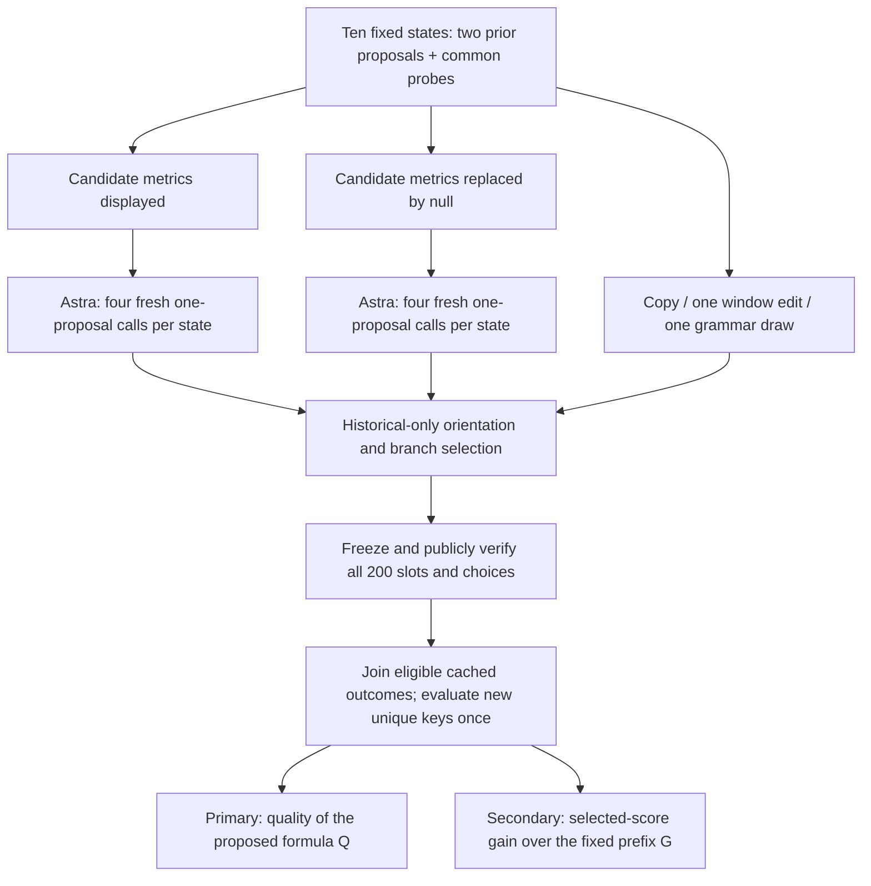

# Matched starts: does candidate feedback improve a new proposal?

**Status: prepared and source-reviewed, before actual collection.** The execution
contract and exact inputs are frozen; public-byte verification must still precede
the first hosted call. This page explains the experiment; it contains no new financial
result. The [full protocol](astra-matched-prefix-plan-v1.md) defines the exact
prompts, generators, eligibility, accounting and stopping rules.

The first Astra study had a real six-step research loop but different sampled
trajectories across feedback conditions. Its [completed pool diagnosis](astra-pool-diagnosis-results-v1.md)
found that full feedback had a weaker realized candidate pool and a smaller
selection gap. That leaves a narrower question: starting from the same two
proposals, does displaying their historical feedback improve the next proposal?

## The controlled decision

Use ten fixed starting states, one for each half-year from 2020 through 2024.
Each state contains the first two proposals from the original withheld-feedback
trajectory. The formulas and two initial probes are identical across conditions.
Only the displayed candidate-feedback package changes.

| Generator | What it does in each state | Charged slots |
| --- | --- | ---: |
| Truthful feedback | Astra receives both prefix candidates' recorded historical metrics and proposes one formula, on four fresh calls | 40 |
| Masked feedback | Astra receives the same prompt with those two feedback entries set to null, on four fresh calls | 40 |
| Copy | Repeat the historical winner from the two prefix proposals | 40 |
| One window edit | Change one temporal window of that historical winner by a fixed schedule | 40 |
| One grammar draw | Emit one expression from a predetermined seeded grammar schedule | 40 |

Every slot gets one proposal opportunity. There is no best-of-four selection,
repair, replacement of failures or feedback between those four continuations.
The cheap controls also receive one attempt each; copies retain their
multiplicity but are not treated as fresh independent generations.

The model supplies bounded expressions and short public justifications. The
broker validates the grammar, computes historical feedback, freezes direction
and records selection. The evaluator supplies the later-period score only after
the full-bank publication gate. Generated Python is never executed.

## Two questions that should not be collapsed into one score

**Q measures proposal quality.** It is the proposed factor's future IC, with
direction fixed by its historical feedback; invalid, ineligible or unusable
proposals receive −1. Average the four Q values within each state, then compare
truthful and masked conditions across all ten states with equal weights.

**G measures what reaches the historical selector.** The selector chooses the
largest absolute historical IC from the two old proposals and one new proposal,
breaking ties by earliest attempt. G is the selected factor's future Q minus
the original two-proposal winner's future Q. A proposal can have a good Q yet
produce zero G because the historical selector rejects it. A historically
selected proposal can have negative G because its later performance is worse.

| Case | Candidate Q | Selected-score gain G |
| --- | --- | --- |
| Copy the historical winner | The winner's Q, usually nonzero | Zero |
| Invalid proposal, rejected before selection | −1 | Zero against the usable prefix |
| New formula selected historically, then unusable in the future | −1 | Can be negative; future failure never changes admission |
| Duplicate of the other prefix member | That member's Q | Zero; duplication adds no selectable candidate |

All branches have the same abstract third-attempt cost .01. Thus incremental
net gain is `G − .01`. The cost represents a research opportunity, not dollars,
provider billing or a trading transaction cost. No P&L is inferred from IC.

## What makes this GenAI research, and what it does not establish

The hosted model generates new expressions conditioned on numerical evidence;
the experiment tests whether that conditioning helps relative to the same model
without the displayed candidate package and to cheap generators. The previous
six-step study tests a sequential research loop. This follow-up deliberately
isolates one decision, so a positive result would not establish useful
long-horizon autonomy. Neither hosted study updates Astra's weights. The
repository's separate local Qwen experiments provide its actual RL evidence.

This is a reused development panel, with no untouched holdout. Some masked
information can be inferred from common probes; hiding a field does not remove
all related information. Four calls quantify only limited conditional
generation variability, assuming independent provider draws if the reported
Monte Carlo SE is interpreted. Ten states are not independent market samples,
and repetition labels do not supply common random numbers.

The fixed allocation rule requires truthful feedback to beat masking and every
cheap reference on Q, its predictive contribution and G, with mean G above .01.
All inequalities are reported. Failure ends this version without extra calls
or tuned prompts; passing alone does not authorize another study. Finite budgets
and retained failures make the result inspectable regardless of its sign.

For execution details, see the [reproduction guide](reproduce-astra-revision-study.md).
The [independent review](audits/astra-matched-prefix-review-v1.md) distinguishes
verified design and implementation properties from experiments not yet run.
