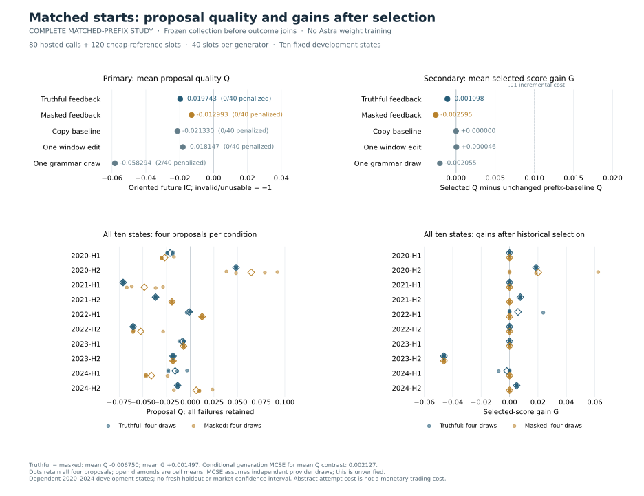

# Matched-prefix results: displayed feedback did not improve candidate quality

The fixed study completed **80 Astra calls and 120 cheap-reference slots**.
Displaying historical candidate feedback did not improve the primary proposal
quality comparison: truthful minus masked mean Q was **−0.0067496**. The
prespecified allocation gate failed. This version is complete and stopped;
there are no additional draws, prompt adjustments or selected subsets.

The [protocol](astra-matched-prefix-plan-v1.md) fixed all ten starting states,
five generators, four branches per generator and the analysis before generation.
The [overview](astra-matched-prefix-overview.md) explains the design, and the
[offline explorer](astra-revision-explorer.html) retains all 200 rows, fifty
state/generator cells, five years, exact actor prompts and thirteen gate checks.

## Proposal quality and selector gain answer different questions

Q is future IC with direction fixed from historical evidence, or −1 for an
unusable candidate. G is the historically selected proposal's future Q minus
the fixed two-proposal baseline's Q. The four continuations are separate
branches; the selector never chooses the best of four. All rows remain in
their forty-slot generator denominators.

| Generator | Usable Q / slots | Mean candidate Q | Mean selected Q | Mean G | Mean G − .01 |
|---|---:|---:|---:|---:|---:|
| Truthful feedback | 40/40 | −.019743 | −.022428 | −.001098 | −.011098 |
| Masked feedback | 40/40 | −.012993 | −.023925 | −.002595 | −.012595 |
| Copy prefix winner | 40/40 | −.021330 | −.021330 | .000000 | −.010000 |
| One scheduled window edit | 40/40 | −.018147 | −.021284 | +.000046 | −.009954 |
| One seeded grammar draw | 38/40 | −.058294 | −.023385 | −.002055 | −.012055 |

Truthful feedback's new proposal was selected in 18/40 branches, compared with
6/40 for masked feedback, 10/40 for window edits and 6/40 for grammar draws.
More historical selections did not imply better future candidate quality.
Truthful minus masked G was **+.0014969**, but truthful G itself was negative
and below copying or a scheduled window edit. Every generator's incremental
net gain was negative under the fixed abstract attempt cost .01. This cost is
not a monetary trading cost; these results do not report P&L.

Rebuild the figure from complete saved evidence using
`python scripts/plot_astra_revision_results.py --output-stem NEW_PATH`.
It verifies saved records and does not recompute market scores.

## Why the grammar comparison needs a decomposition

The two unusable grammar slots are both in 2021-H2, repetitions 1 and 3. Both
were syntactically valid, eligible zero-valued expressions with unusable
historical feedback (`n_dates = 0`), not failed future assessments. They
remain Q = −1 with G = 0 because the valid prefix baseline survives selection.
They are not dropped or redrawn. Every hosted candidate and all selected
outcomes were usable.

The identity `mean Q = −1 + validity p + predictive contribution q` uses the
same all-slot denominator. Truthful minus grammar total Q is **+.0385514**,
comprising **+.05 validity** and **−.0114486 predictive contribution**. Thus
its higher total score does not demonstrate better predictive content. Grammar's
valid-only mean IC is −.0087305 over 38 candidates; that conditional average
must not replace the registered forty-slot score or be interpreted causally.
Truthful minus masked has zero validity contribution, so that primary deficit
is entirely in the recorded IC contribution.

## The fixed allocation decision failed

The thirteen strict, unrounded inequalities are retained in the result and
explorer. Five passed and eight failed. Truthful Q beat copying and penalized
grammar, but not masking or window edits. Its predictive contribution beat
only copying. Its G beat masking and grammar, but not copying or window edits,
and its mean G did not exceed .01. These point comparisons form a resource
allocation rule, not a statistical significance test.

The conditional-generation MCSE for the primary Q contrast is **.00212748**.
It uses four hosted draws per condition/state and assumes independent provider
draws, which cannot be verified. It is not a market standard error, confidence
interval or generalization guarantee. Ten reused half-years and five years
are dependent development evidence. No general claim that feedback harms
financial research follows from this fixed sample.

## Text grounding was frozen before these outcomes

The ancillary [rationale audit](audits/astra-revision-grounding-results-v1.md)
coded all 80 public responses before the current financial assessment. It
recorded 329 factual units, five ambiguities and 123 untested-hypothesis
annotations; it coded no contradicted or unsupported reported measurements.
That is one internal AI reviewer's descriptive judgment, not a semantic-truth
certificate or evidence about hidden reasoning. The reviewer knew prior study
outcomes and helped author the protocol. The coding plan was declared after
collection began, so it is not a preregistered primary endpoint.

Its [secondary interpretation](audits/astra-revision-grounding-interpretation-v1.md)
shows examples of legitimate numerical comparison and explicit untested
composition. The audit and negative financial result can both hold: consistency
with supplied evidence does not establish that the generated proposal predicts
the future. Accurate citations also cannot identify the model's internal causal
mechanism.

## Execution and public evidence chronology

1. Prepared prompts and rules were published at `a33070e`; all 302 bound paths
   matched anonymous public downloads at 11:29:57 UTC on 2026-10-01, before
   collection began at 11:30:39 UTC.
2. Collection ended at 12:13:30 UTC: exactly 80 hosted calls, 120 cheap slots,
   98 new historical-feedback calls and zero automatic retries. All 200
   directions and historical choices were frozen before current outcome joins.
3. The submissions were published at `184f422`; all 786 Gate 2 paths matched
   anonymous downloads at 12:21:45 UTC.
4. Rationale coding was frozen at 12:22:03 UTC and published at `39a3522`.
   Its exact bytes and plan were anonymously verified at 12:33:10 UTC while
   the current assessment request was still absent.
5. One assessment invocation completed **99 new future evaluations**, reusing
   **34 exact prior keys**, for 133 unique task/AST/direction outcomes. Reuse
   changes execution cost, not the 200-slot population. No new model calls,
   automatic retries or replacement formulas occurred during assessment.

The [complete result](../results/astra_matched_prefix_v1.json) has SHA256
`89162112ddad384ed8917a8b1198ce94044abc90ff15e1680bfe88b66eb43c37`.
Its [frozen submissions](../results/astra_matched_prefix_v1_submissions.json)
have SHA256 `672d93cd8faababc71a7b3b5ff3823da840061479798f0ec1f2b6eef1cc9577d`.
The execution directory retains request, plan, receipts and started/completed
job records. Original Astra and pool-diagnosis records remain unchanged.

Root's actual [guarded saved replay](replay-astra-revision-evidence.md) verified
the complete result, 685 captured execution files and exact explorer/report/
prompt agreement. It performed zero model calls or market rescoring and read
no raw market data. Saved replay creates disposable copies of public evidence;
its guards are not an adversarial operating-system sandbox. Independent
[arithmetic review](audits/astra-revision-results-review-v1.md) reconstructed
4,570 floating-point comparisons, with maximum deviation 5.55e−17 and no
structural or numerical discrepancy. The
[narrative review](audits/astra-revision-narrative-review-v1.md) records two
framing clarifications and their resolution.

All hosted calls requested Astra/ultra/default tier. Their saved summaries do
not attest provider-internal model weights, hidden context or independent
sampling. Token use and caching differ across calls despite equal call counts.
The common initial probes can reveal some masked information. Revised
industry-portfolio data and unaudited model pretraining further limit historical
claims. This one-proposal study tests inference-time generation; it trains no
Astra weights and establishes no useful long-horizon autonomy.
