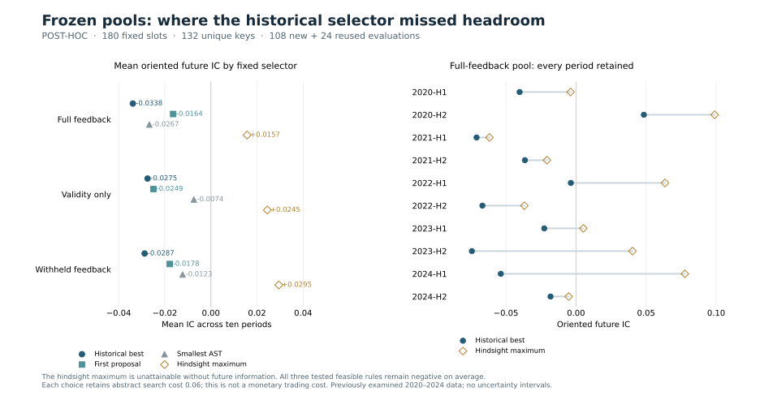

# Astra frozen-pool diagnosis: missed headroom and weak realized selectors

**The full-feedback pools contain positive mean hindsight IC, but all three
tested feasible selection rules remain negative.** The historical winner has
mean oriented future IC −0.033823; the literal first proposal gives −0.016355;
the smallest eligible AST gives −0.026670. Choosing with future knowledge would
give +0.015711. That last value is an unattainable ceiling, not an available
selection policy.

This is the completed **post-hoc** `astra-frozen-pool-diagnosis-v1`, designed
after the original selected outcomes were known. The
[original Astra result](astra-agent-results-v1.md) is unchanged. The
[new protocol](astra-pool-diagnosis-plan-v1.md) was published at
[`8afcf868`](https://github.com/Siquan-Wang/alpha-research-rl/commit/8afcf868301bd5daab0999bdfa4f2f2125187479)
before any previously unassessed candidate was scored.

## Complete bounded execution

All **180 original proposal slots**, 30 six-candidate episodes and ten periods
remain. They map to 132 task/AST/fixed-direction keys; 24 keys reuse the original
selected assessments and **108 new CPU evaluator calls** fill the remaining
keys. Every slot has usable assessment support. There were zero new formulas,
model calls, retries, replacements or extra periods. Distinct ASTs do not imply
distinct economic signals or independent samples.

Root verified the exact bytes of all 32 bound public files through
unauthenticated retrieval at `2026-10-01T10:11:42.099795+00:00`. The first durable
job start was `10:12:12.067207+00:00`; the final completion was
`10:12:45.910050+00:00`, both on 2026-10-01. The public
[execution ledger](../artifacts/astra-pool-diagnosis-v1/execution/) retains every
STARTED/COMPLETED record and publication receipt. It contains aggregate metrics,
not raw return arrays.

The [complete result](../results/astra_pool_diagnosis_v1.json) has file SHA256
`ed50f86cbe876585b9de81c0960ca0a0a9d9c588345e82001ef5706141f0df2c` and is byte-identical
to the retained COMPLETE report. The
[saved replay](../results/astra_pool_diagnosis_v1_replay.json) verifies evidence
and arithmetic without market recomputation. Its guarded entrypoint passed with
financial/training imports, raw/private data, network and subprocess use
prohibited after standard-library platform detection. Those checks are not an
adversarial sandbox or an attestation of package binaries.

## Fixed selectors and all-period means

Values below are oriented future IC, averaging all ten periods equally. Direction
is fixed from historical feedback. Every comparison retains the same abstract
six-proposal search cost .06, including the first-proposal rule; subtract .06
to obtain mean utility. This is not a monetary trading or API cost.

| Arm | Original historical winner | Literal first | Minimum AST | Hindsight maximum |
|---|---:|---:|---:|---:|
| Full feedback | −0.033823 | −0.016355 | −0.026670 | +0.015711 |
| Validity only | −0.027459 | −0.024908 | −0.007375 | +0.024480 |
| Withheld feedback | −0.028719 | −0.017844 | −0.012255 | +0.029464 |

The two cheap alternatives improve on the historical winner in all three arms,
but none has positive mean IC. They were chosen after v1 outcomes were known;
this is diagnostic evidence, not validation of a newly selected strategy.
The full-feedback hindsight maximum is positive in five periods and negative
in five. An oracle's advantage is guaranteed by maximizing over the pool; it
does not show that a feasible selector could identify the winning member.

The mean over all sixty candidate slots within each arm is also negative:
full −0.021811, validity −0.011689 and withheld −0.009603. These pool averages
retain every slot, including cache references. They are not the outcome of a
prospectively executed random-selection policy.

## Separating realized pool ceiling and selection gap

Let `S` be original selected utility, `O` the hindsight maximum, and `R=O-S` the
selection gap. Each arm contrast satisfies `Delta S = Delta O - Delta R`.

| Arm contrast | Delta S | Delta O | Delta R |
|---|---:|---:|---:|
| Full − validity | −0.006364 | −0.008768 | −0.002404 |
| Full − withheld | −0.005104 | −0.013753 | −0.008649 |
| Validity − withheld | +0.001260 | −0.004985 | −0.006244 |

Full feedback has a lower realized pool ceiling than either control. Its
slightly smaller selection gap offsets part of that difference. Thus the
negative full-minus-validity headline cannot be attributed simply to a larger
selection gap in the full-feedback arm. This decomposition is descriptive:
`Delta O` is not a causal generation contribution, and the arms do not share
the same generated trajectory. All candidates are valid here, so validity
penalties contribute zero to these contrasts.

For full feedback, every original selection lies below its own hindsight maximum:

| Period | Original IC | Hindsight IC | Gap |
|---|---:|---:|---:|
| 2020-H1 | −0.040199 | −0.003924 | 0.036275 |
| 2020-H2 | +0.048422 | +0.098915 | 0.050493 |
| 2021-H1 | −0.070919 | −0.061736 | 0.009183 |
| 2021-H2 | −0.036422 | −0.020735 | 0.015687 |
| 2022-H1 | −0.003675 | +0.063463 | 0.067138 |
| 2022-H2 | −0.066756 | −0.036860 | 0.029896 |
| 2023-H1 | −0.022648 | +0.005225 | 0.027873 |
| 2023-H2 | −0.074261 | +0.040320 | 0.114581 |
| 2024-H1 | −0.053624 | +0.077652 | 0.131276 |
| 2024-H2 | −0.018148 | −0.005207 | 0.012941 |

The JSON retains every task and year for all arms, selectors and contrasts.
The full-minus-validity yearly `Delta S` values are −0.007965, +0.000230,
+0.018461, −0.005111 and −0.037435 for 2020 through 2024. None is excluded.

## Allocation decision and interpretation

The registered IC-ceiling no-go is **false**: the full-feedback mean hindsight
IC is +0.015711. The fixed-cost utility no-go is **true**: even that hindsight
maximum averages −0.044289 after the common .06 cost. These bounds apply only
to one selection from each exact six-candidate pool, fixed directions and the
registered scoring/cost convention. They do not cover abstention, pooled
eighteen-candidate search, new formulas, other trajectories or other periods.

No automatic model study follows from the positive IC ceiling. A separate
research decision must identify a remaining question and prospectively fix its
budget and comparisons. The original v1 report, stopped financial gate and
deferred local-model branch are not restarted by this diagnosis.

There is one realized trajectory per condition/period on previously examined,
revised 2020–2024 development data. These results establish neither a fresh
holdout effect, significance, profitability, factor originality, the necessity
of an LLM generator, nor Astra weight training.

To replay the saved evidence, run `python scripts/replay_published_astra_pool.py`.
To rebuild this figure into new files, install the optional `plots` dependencies
and run `python scripts/plot_astra_pool_results.py --output-stem pool-figure-copy`.
The [execution guide](reproduce-astra-pool-diagnosis.md) gives the full provenance
and no-retry boundary. The
[independent saved-results review](audits/astra-pool-results-review-v1.md)
reconstructs the completed ledger and arithmetic separately from the
[pre-score implementation audit](audits/astra-pool-diagnosis-review-v1.md).
