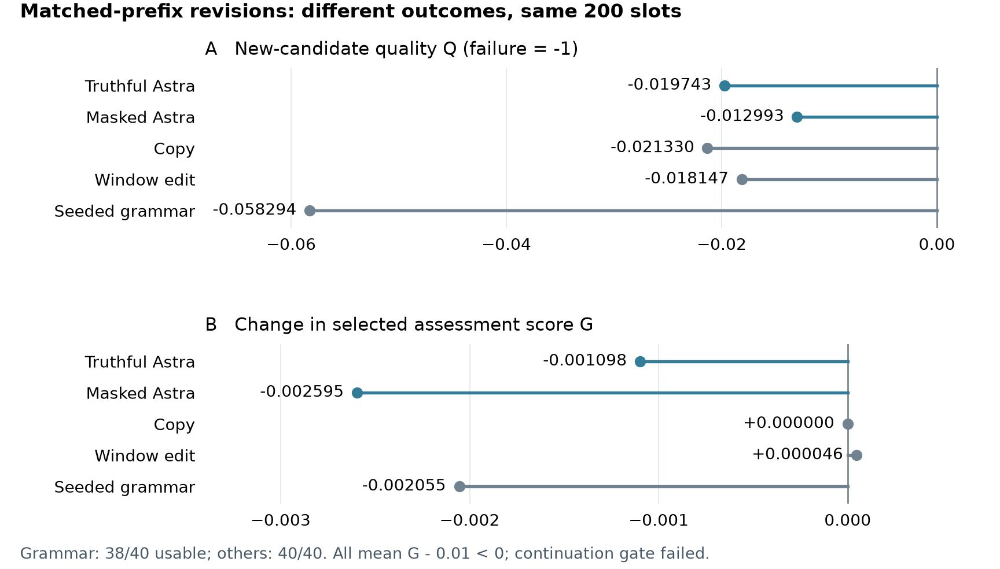
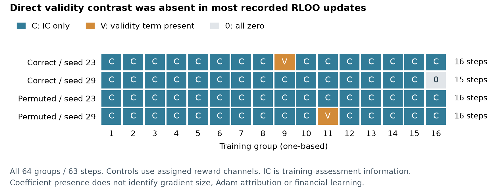

# Does feedback improve factor research beyond cheap controls?

*A development-data case study of hosted research agents and local language-model reinforcement learning. Evidence through 1 October 2026.*

## Abstract

Executable proposals, plausible explanations and higher evaluated reward need not imply better financial research. This note examines that distinction through two separate implementations: 260 hosted Astra inference decisions and actual Qwen3-0.6B LoRA weight training. In a six-proposal financial workflow, exposing quantitative feedback produced lower subsequent rank information coefficient (IC) than validity-only feedback. A later matched-prefix experiment also failed its declared continuation criteria: truthful feedback reduced candidate quality relative to masked feedback, and neither hosted condition improved the historical selection rule beyond cheap alternatives. The two correctly linked Qwen RL runs improved failure-penalized utility versus SFT, mostly through evaluation validity; predictive contribution did not consistently improve versus reward-permuted controls. Saved records complicate the explanation: 61 of 63 RLOO optimizer updates had no direct validity-penalty contrast. These are bounded development findings, not evidence of profitability, a new algorithm, or general harm from feedback.

## 1. Question, task and evidence units

The question is whether feedback improves the next research decision, beyond producing valid expressions or following a numerical ranking. We separate feedback supplied during inference from feedback used to update model weights. Hosted Astra proposes formulas through a broker that executes a restricted expression grammar and returns permitted evidence. Its weights are never trained here. Qwen undergoes supervised fine-tuning (SFT) and reinforcement learning with leave-one-out advantages (RLOO); its financial task is a single proposal, not a learned multistep research workflow.

The financial panel contains daily returns for 49 industry portfolios from the Kenneth R. French Data Library. An expression transforms historical returns into a cross-industry signal. Assessment measures mean daily Spearman correlation with five-session future returns. Each task uses an earlier half-year for feedback and a later half-year for assessment; the last five signal rows of each interval are purged so labels cannot cross its boundary. Signal orientation is fixed from feedback IC, never chosen using assessment outcomes. Generated Python is not executed: expressions must satisfy a bounded return-only grammar and data-support requirements.

The ten assessment half-years, 2020 H1 through 2024 H2, were already development data before these comparisons. They are not a fresh holdout. Later study designs could respond to earlier results, although each new collection and assessment boundary was frozen separately. No 2025-or-later policy outcome was evaluated. These are revised industry-portfolio histories, not point-in-time individual-stock data; vintage effects and pretrained-model exposure remain unaudited. IC is not portfolio return, and abstract action costs are not transaction costs. [Task protocol](next-research-study.md)

| Study | Controlled comparison | Recorded units |
| --- | --- | --- |
| Hosted sequential proposals | Full, validity-only and withheld incremental feedback | 180 decisions; 30 episodes; 10 periods |
| Hosted matched-prefix revisions | Truthful/masked feedback, copy, window edit, grammar | 80 decisions plus 120 cheap slots; 10 states |
| Local post-training | SFT, two RLOO runs, two reward-permutation controls | 64 training groups; 900 evaluation completions |

Calls, proposals and repeated draws are not independent markets. Each financial comparison ultimately reuses ten periods across five years.

## 2. Sequential proposals: additional feedback did not help here

The first hosted study gave each of three conditions six proposal turns per period. All conditions received the same two initial financial probes. Thereafter, full feedback exposed each proposal's historical metrics and support; validity-only exposed grammar and duplicate flags; withheld feedback returned a fixed acknowledgment. Invalid or duplicate attempts would consume the same budget. All conditions used the same actor-hidden deterministic final selector: choose the usable proposal with largest absolute historical IC, breaking ties by earliest attempt, then apply its historical orientation.

Thus the intervention concerned **additional quantitative evidence available to the generator**, not the presence of financial evidence anywhere in the pipeline. Even the withheld condition benefited from the initial probes and final selector. Each decision used a fresh ephemeral Codex CLI session with the permitted episode history, requesting Astra with ultra reasoning and default service tier. Sixty calls per condition matched decision opportunities, not tokens, hidden computation or latency.

All 180 proposals were grammar-valid and historically usable; all 30 selected proposals were assessment-usable. Mean oriented assessment IC was -0.033823 for full feedback, -0.027459 for validity-only and -0.028719 for withheld feedback. The primary full-minus-validity contrast was **-0.006364**. Full-minus-withheld was -0.005104; validity-minus-withheld was +0.001260. A common six-attempt cost of 0.06 leaves these contrasts unchanged. Four period-level primary contrasts were positive, five negative and one tied; all remain reported. [Original results](astra-agent-results-v1.md)

All candidate lists and selections were publicly frozen before any selected-expression assessment. Nevertheless, one trajectory per condition and period cannot separate a stable feedback effect from generation variability. Identical initial prompt bytes sometimes produced different first proposals, and reported input-token counts could differ. The records attest requested settings and observed events, not identical backend context, model-weight identity or adversarial filesystem isolation. No actor tool event was observed; financial feedback came through the broker. There were 95 distinct expression syntax trees, but syntactic diversity is not evidence of distinct economic signals.

## 3. Pool diagnosis: hindsight opportunity is not a feasible selector

After seeing those selected outcomes, we asked whether useful candidates existed but the selector missed them. This was an explicitly **post-hoc** diagnosis, specified before assessing previously unselected proposals. It preserved all 180 slots, expressions and historical orientations: 132 distinct task/canonical-syntax-tree/direction keys required 108 new CPU assessments and reused 24 existing keys. It made no model calls.

Alongside the original selector, the diagnosis evaluated literal first-proposal selection, minimum syntax-tree size with earliest ties, and a hindsight oracle choosing the best assessment score. Every selector retained the original 0.06 pool cost. All three feasible selectors had negative mean IC in every condition. Full-feedback oracle IC was +0.015711, versus +0.024480 for validity-only and +0.029464 for withheld feedback. These ceilings are unavailable to a deployable historical selector.

Let S be original selected utility, O the oracle utility and R = O - S the selection gap. The identity `difference(S) = difference(O) - difference(R)` showed that full feedback had both a lower realized pool ceiling and a slightly smaller selection gap than the controls. It did not support attributing the entire deficit to selection. Positive oracle IC established only that hindsight could choose better within these fixed pools; it did not show how to identify those choices or that an LLM was necessary to generate them. The original 30 outcomes and headline were unchanged. [Pool diagnosis](astra-pool-diagnosis-results-v1.md)

## 4. Matched prefixes: candidate quality and selection gain diverge

The follow-up held the research state fixed. Each of ten periods supplied the same two-proposal prefix to five generators: truthful-feedback Astra, masked-feedback Astra, copying the prefix winner, a deterministic window edit of that historical winner, and a seeded grammar generator. Both hosted conditions retained the numerical initial probes, prefix formulas and structural statuses; masking removed candidate metric/support bundles, not every inferable fact about a candidate. A common structural dependency limit allowed the current row and at most sixty earlier rows. Each generator received four separate one-attempt branches. Hosted conditions contributed 80 calls; cheap generators contributed 120 slots. There was no best-of-four selector: each branch independently considered its two prefix candidates plus one new proposal.

The primary outcome Q was the new candidate's historically oriented assessment IC, with unusable attempts assigned -1. The secondary G was the assessment score of the historical selector after adding that candidate, minus the prefix baseline's score. Copy therefore has G = 0, but its Q need not be zero. Repetition means were formed within state, then averaged equally across ten states. All 200 attempts, including duplicates and failures, remained in their denominators.

| Generator | Usable / 40 | Candidate Q | Selection gain G |
| --- | ---: | ---: | ---: |
| Truthful Astra | 40 | -0.019743 | -0.001098 |
| Masked Astra | 40 | -0.012993 | -0.002595 |
| Copy | 40 | -0.021330 | 0.000000 |
| Window edit | 40 | -0.018147 | +0.000046 |
| Seeded grammar | 38 | -0.058294 | -0.002055 |

Truthful-minus-masked Q was **-0.006750**. Its G contrast was +0.001497, yet truthful G itself was negative and below copy and window edit. This is coherent: prefix fallback changes the selected outcome, so relative selection gain can improve while new-candidate quality worsens. Truthful proposals became the historical selector's final winner in 18 of 40 branches, versus six for masked proposals; more frequent selection did not deliver improved assessment value.

The grammar comparator illustrates denominator sensitivity. Its two failures were eligible zero signals with unusable historical feedback, not failed future assessments. They retained Q = -1, while the valid prefix preserved G = 0. Truthful Astra's +0.038551 Q advantage over grammar decomposed into +0.05 usability and **-0.011449** all-attempt IC contribution. Conditional IC among grammar's 38 usable proposals cannot replace the forty-attempt endpoint.



*Figure 1. Means retain all forty slots per generator, including failures. Candidate quality and selection gain answer different questions. Four branches repeat each fixed state; the [complete report](astra-matched-prefix-results-v1.md) retains all period-level values.*

The plan preceded new calls. All 200 submissions, historical directions and selections were published before cached future outcomes were joined or 99 new future assessments were computed; 34 existing keys were reused. Continuation required truthful feedback to beat masked feedback and every cheap comparator on Q, all-attempt IC contribution and G, plus mean G above the 0.01 abstract action cost. Five of these thirteen inequalities passed and eight failed. This allocation rule was not a significance test. The study stopped without extra draws or prompt tuning. Four repetitions provide limited conditional generation information: the primary contrast's estimated Monte Carlo standard error was 0.002127 under an independent-provider-draw approximation, not a market confidence interval. [Matched-prefix results and protocol](astra-matched-prefix-results-v1.md)

## 5. Actual weight training: reward gains require controls

The separate Qwen study trained 2,293,760 LoRA parameters. SFT used 96 updates over 32 training half-years from 2002–2017. Its teacher selected among twelve formulas using historical scores; this teacher had more information than the actor's two probes. Two RLOO runs then attempted sixteen four-completion groups each, producing 16 and 15 optimizer steps. The skipped group had constant rewards. Training-assessment outcomes were gradient data, not heldout evidence.

Evaluation retained SFT and both RL checkpoints across the ten development periods, true and exchanged probe evidence, eight stochastic draws and one greedy draw per condition. RLOO improved true-evidence mean utility over SFT by +0.031458 and +0.026180. Utility was oriented IC minus 0.01 for usable proposals and -1.01 otherwise. Both gains contained a +0.025 validity component; IC-contribution improvements were only +0.006458 and +0.001180. [Original post-training results](financial-proposal-results-v1.md)

A follow-up, designed after those results, trained two reward-linkage controls from the same SFT parent. Each generated its own on-policy groups and uniformly permuted all four true rewards before computing leave-one-out advantages, including identity permutations and failures. Correctly linked RL exceeded its corresponding control by +0.023032 and +0.018368. However, their IC-contribution contrasts were +0.010532 and -0.006632: seed 29's utility advantage came from avoiding failures despite worse predictive contribution. Both controls also improved over SFT. Uniform reward permutation has zero conditional expected pre-clipping score-function gradient; realized gradients, clipped gradients and Adam updates need not be zero. [Reward-linkage controls](reward-linkage-results-v1.md)

Across all five policies, 900 evaluation completions were retained. Every stochastic policy remained below the exact uniform sixteen-formula reference on registered utility. All greedy policies produced the same sixty-day mean-return formula. A [saved-output diagnosis](proposal-diversity-v1.md) found teacher-grid syntax matches in 861 of 881 usable completions, limiting evidence of generative novelty. True-versus-exchanged evidence effects were inconsistent.

Paired generation-error estimates preserved common-seed covariance. Correct-minus-control utility MCSEs were 0.013041 and 0.018558, conditional on checkpoints and these periods. Their validity advantages came from only one and two paired slots. Such rare events make eight-draw variance estimates fragile; these errors omit training variation and dependent-market uncertainty. [Reliability analysis](reliability-analysis-v1.md)

## 6. Evaluation validity is not training-gradient attribution

A final saved-only analysis examined all four RL/control runs: 64 groups, 256 attempts and 63 optimizer updates. Write the reward as:

```text
R = -1.01 + V + C
V = usable indicator
C = V * oriented training-assessment IC
A_R = A_V + A_C
```

C is a validity-gated contribution; its zero for unusable proposals is accounting, not measured IC. The same recorded permutation was applied to all channels in controls, without reordering completion log-probabilities. Leave-one-out linearity also decomposes the saved sampled surrogate loss.

**Sixty-two of 64 groups, covering 61 of 63 optimizer updates, had zero direct validity coefficients.** Only correct RL with training seed 23 and the reward-permutation control with training seed 29 had a mixed-validity group. Thus evaluation gains dominated by validity do not establish that most training steps directly contrasted the invalidity penalty. Conversely, this count does not show the two mixed groups were unimportant or that other updates could not change validity. Shared parameters, prior updates and SFT remain relevant; C itself depends on usability.



*Figure 2. Each row retains sixteen groups; displayed numbering is one-based. One constant-reward group skipped its update. Zero direct validity coefficients do not imply zero eventual effect on valid generation.*

Coefficient magnitudes, sign opposition and additive scalar losses describe credit allocation, not shares of learning. Per-completion score-gradient vectors and intermediate optimizer states were not saved. Where validity and total advantage vectors are noncollinear, unobserved score gradients can be perturbed across completions using coefficients orthogonal to the total-advantage vector. This leaves the total gradient unchanged while changing the opposing component gradients. Scalar log-probabilities and a total gradient norm cannot resolve that ambiguity. The analysis reconstructs arithmetic, not parameter movement or causal financial learning. [Reward-credit results](reward-credit-results-v1.md)

## 7. Reliability, related methods and limits

One numerical failure matters directly to the training interpretation. Intended generation settings could be overwritten by model defaults; explicit configuration and distribution tests corrected that issue. A subsequent real-Qwen BF16 check still found a maximum 0.464909 difference between cached-generation and full-forward token log-probabilities. Moving the financial actor to FP32 with TF32 disabled reduced the observed discrepancy to approximately 0.0000262 before financial training. This is a measured implementation repair, not universal floating-point equivalence. [Sampling review](audits/2026-10-01-financial-policy-review.md)

The methods have clear prior art. [R&D-Agent-Quant](https://arxiv.org/html/2505.15155v2) already combines hypothesis generation, implementation, validation and feedback, with bandit scheduling of factor/model research. [AlphaGen](https://github.com/ICT-FinD-Lab/alphagen) applies reinforcement learning to formulaic factor generation. RLOO follows established REINFORCE-style post-training methods, including [Ahmadian et al.](https://arxiv.org/html/2402.14740v2). Different universes, objectives and budgets preclude performance rankings against these works. The accounting identities here are elementary, not new learning algorithms.

This sequence tests progressively narrower explanations after negative results; it is not one preregistered experiment. Reusing development periods, revised histories, limited seeds and unaudited pretraining exposure restrict financial inference. Chronological separation blocks specified label access, not all selection bias or contamination. More draws on the same panel could reduce conditional generation noise without creating independent financial evidence.

Synthetic opportunity gates, sealed-confirmation fixtures and historical saved-result replay test specified engineering properties; they add no financial observations. Failed gates remain stopped. Public plans, candidate freezes, source-bound reports and released LoRA adapters make the claims inspectable, but do not convert null results into alpha. The bounded finding is that these implementations demonstrated execution and weight updates without establishing improved evidence-dependent factor discovery beyond the declared controls.

The project and this note were developed with AI assistance, including implementation, analysis and review. Internal reviewers sometimes authored earlier protocols or components; their participation is disclosed in linked audits. These reviews are not external peer review, and the work is not represented as solely manual authorship. [Evidence and reproduction entry point](../README.md)
