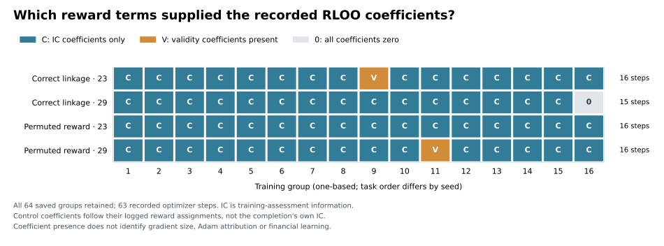

# Evaluation gains and training credit answer different questions

**Post-hoc accounting of all four completed RLOO runs found that 61 of 63
recorded optimizer steps had zero direct validity-advantage coefficients.**
Only two of the 64 groups contained both usable and failed proposals. Thus the
earlier finding that fewer failures explained most evaluated reward improvement
does not imply that most training updates received a failure-penalty contrast.
The earlier evaluation accounting remains correct; this answers a different
question about the saved training objective.

This is neither a gradient-share estimate nor evidence of financial learning.
Two rare updates may matter substantially, the IC component itself is gated by
usability, and per-component score gradients and Adam attribution are unavailable.
All four runs and every failed, repeated and skipped attempt are retained.

## Complete population

| Run | Usable proposals / attempts | Groups with validity contrast / all groups | Recorded updates | Updates with zero direct validity coefficient |
| --- | ---: | ---: | ---: | ---: |
| Correct linkage, seed 23 | 63 / 64 | 1 / 16 | 16 | 15 |
| Correct linkage, seed 29 | 64 / 64 | 0 / 16 | 15 | 15 |
| Permuted reward, seed 23 | 64 / 64 | 0 / 16 | 16 | 16 |
| Permuted reward, seed 29 | 63 / 64 | 1 / 16 | 16 | 15 |
| Total accounting | 254 / 256 | 2 / 64 | 63 | 61 |

Across all groups, **62/64** have zero validity coefficients; across groups that
actually updated parameters, the count is **61/63**. Correct seed 29's final
group had constant rewards and skipped its update. These denominators are not
independent learning replications or estimates of causal importance.



The figure uses one-based group numbers. The machine-readable report uses
zero-based indices. Controls receive their actual permuted reward assignments;
an IC coefficient in a control need not come from that completion's own IC.

## What is decomposed

Let V indicate a usable training assessment, and let C equal its oriented IC
when usable, zero otherwise. That zero is an accounting convention for a failed
attempt, not a measured IC. The saved reward is:

```text
R = -1.01 + V + C
A_i(X) = X_i - mean(X_j for the other three samples)
A(R) = A(V) + A(C)
L_X = -sum(A_i(X) * saved_preupdate_completion_logp_i) / 4
L_R = L_V + L_C
```

For controls, the same saved permutation is applied to R, V and C before
computing advantages; sample and log-probability order stays fixed. The common
constant disappears under leave-one-out centering. These are ordinary linear
identities, not a new RL algorithm. The [analysis plan](reward-credit-plan-v1.md)
specifies the complete population, numerical tolerances and attribution limits.

The scalar L values describe the sampled surrogate at each recorded policy.
They are not measured loss reductions or a basis for ranking different runs.
The ICs used here are **training-assessment data**, not a held-out evaluation.

## Why coefficient counts are not learning shares

The two mixed groups illustrate both the usefulness and the limit of accounting:

| Run and task | Zero-based group | Sum of absolute validity coefficients | Sum of absolute IC coefficients | Samples with opposite V/C signs |
| --- | ---: | ---: | ---: | ---: |
| Correct 23, 2004 H1 | 8 | 2.000000 | .124143 | 2 / 4 |
| Permuted 29, 2011 H2 | 10 | 2.000000 | .174385 | 1 / 4 |

These are raw coefficient scales, not normalized shares. Their gradients also
depend on the unrecorded derivative of each sampled completion's log probability.
The saved total gradient norm does not identify those component vectors, and
clipping plus optimizer history further prevents attributing parameter changes.
The plan includes a constructive explanation of that nonidentifiability.

In correct seed 23's mixed group, the first proposal was invalid. Its accounting
C=0 exceeded its valid peers' negative ICs, giving it IC advantage **+.039810**,
while its validity advantage was **−1** and total advantage **−.960190**.
An isolated component therefore need not be a sensible alternative reward.
No component-only training is inferred or initiated from this diagnostic.

Zero direct V coefficients do not imply that validity cannot improve. C is
already gated by usability; previous updates, SFT and shared parameters may
affect later output validity. Conversely, nonzero IC coefficients do not prove
that the resulting parameter update improved prediction. The original
[financial evaluation](financial-proposal-results-v1.md) and
[reward-linkage conclusions](reward-linkage-results-v1.md) remain unchanged.

## Execution and independent arithmetic

The one saved-data invocation completed successfully on 2026-10-01 at
15:08:12 UTC, retaining all **64 groups and 256 samples**. It used Python's
standard library and performed no model execution, backward pass, optimizer
step, raw-market read or new financial score. Its recorded .177-second elapsed
time is a host-specific processing observation, not a benchmark.

- [Complete result](../results/reward_credit_v1.json): SHA-256
  `59d31578928894581208c8928fd38690b839d0c12264c38e64779ffc19957cb7`.
- [Execution record](../artifacts/reward-credit-v1/execution.json) and
  [independent inspection summary](../artifacts/reward-credit-v1/independent-inspection.json).
- [Implementation review](audits/reward-credit-review-v1.md) and
  [design/interpretation review](audits/reward-credit-design-review-v1.md),
  with author participation and scope disclosed.

Root's separate check used 60-digit Decimal arithmetic and direct means of the
other three samples, importing no project module. All **3,752 numeric comparisons**
passed; the largest absolute discrepancy was **2.93e−16**. It also checked the
complete denominators and displayed sign accounting. This is a numerical
cross-check, not a substitute for the main strict parser or external peer review.
The combined artificial suite passed **64 tests in .26 seconds**; Ruff passed.
The final result figure was rendered and visually inspected.

## Reproduce the accounting

From this source version, using an existing Python 3.11+ interpreter, choose a
fresh output path in an existing directory:

```bash
python -I -S -B scripts/analyze_reward_credit.py --output .local/reward-credit-check-001.json
```

The two input byte hashes must match the plan. The command does not fetch data,
load weights or install packages. It refuses an existing output. Require exit
zero; a file left by a failed write is not accepted completion evidence.

The independent arithmetic check reads the published canonical result. Use the
following command, including isolated startup and without optimization flags:

```bash
python -I -S -B scripts/inspect_reward_credit.py
```

The public inspection source differs from the separately executed copy only in
import formatting; the retained record identifies both source hashes.
The optional figure requires an already installed Matplotlib:

```bash
python scripts/plot_reward_credit.py --input results/reward_credit_v1.json --output .local/reward-credit-figure
```

No model or market study is restarted by these commands. The analysis is
post-hoc clarification of existing records; all failed research gates remain
stopped, and no additional learning or economic replication is claimed.
