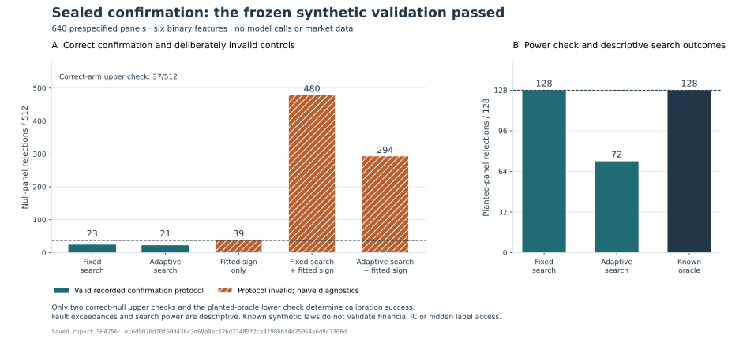

# Sealed confirmation: complete synthetic validation v1

The single frozen run completed all **512 null and 128 planted panels**. Its
three predeclared calibration checks passed: fixed-search null rejections
**23/512**, adaptive-search null rejections **21/512**, and planted-oracle
rejections **128/128**. Every intentionally leaking configuration was marked
`PROTOCOL_INVALID`. This validates observed behavior of the new synthetic
interface under its declared construction; it does not calibrate the existing
financial IC results or demonstrate a useful learned research policy.



The [protocol](sealed-confirmation-plan-v1.md), exact source and tests, and
prepared contract were published at
[`00c17f400bda3f25b995db3b8e35150110fe5b97`](https://github.com/Siquan-Wang/alpha-research-rl/commit/00c17f400bda3f25b995db3b8e35150110fe5b97).
All seven required files were anonymously retrieved and matched at
**2026-10-01 13:40:23.540538 UTC**, before recorded execution began at
**13:40:37.622332 UTC**. The last panel completed at **13:40:59.067740 UTC**.
The 21.445-second interval is recorded start-to-last-panel elapsed time,
excluding preparation, publication checks and replay; it is not a CPU benchmark.

## Complete outcomes

Every panel appears in every row's denominator. The oracle is a predetermined
feature function, not a model or a trained search policy. Fault rows retain
their deliberately misapplied single-candidate calculations as diagnostics.

| Configuration | Recorded protocol | Null rejections /512 | Null accuracy | Planted rejections /128 | Planted accuracy |
| --- | --- | ---: | ---: | ---: | ---: |
| Fixed search, then confirmation | Valid | 23 | .500389 | 128 | .751434 |
| Adaptive search, then confirmation | Valid | 21 | .499146 | 72 | .637939 |
| Predetermined oracle | Valid | 15 | .497887 | 128 | .751434 |
| Fit only the constant direction on confirmation | **Invalid; naive diagnostic** | 39 | .524384 | 10 | .524750 |
| Select fixed-bank candidate and direction on confirmation | **Invalid; naive diagnostic** | 480 | .572929 | 128 | .751434 |
| Select adaptive candidate and direction on confirmation | **Invalid; naive diagnostic** | 294 | .557495 | 92 | .652588 |

Here “valid” describes the recorded sealed interface, conditional on the stated
label law and information boundary. The helper cannot attest undisclosed outside
access or prove that arbitrary supplied labels satisfy its null assumptions.

The fixed search spends 32 requests enumerating masks 0 through 31, which
explicitly include the planted mask 3. It selected that mask with positive
orientation in every planted panel. The adaptive search also spends 32
requests but follows a feedback-dependent bit-flip path; it selected mask 3
in **69/128** planted panels, distinct from its 72 rejection events. Rejection
counts must not be described as numbers of recovered mechanisms. This observed
search limitation is retained; the method or seeds were not changed afterward.

Across all 640 panels, each fixed/adaptive search arm spent 20,480 requests;
the sign-only fault spent 640 and the predetermined oracle spent 0. All repeated
proposals consumed their recorded attempts. Correct adaptive search retained
**14,345** duplicate attempts; leaking adaptive search retained **14,236**.
There were **82,560** charged feedback requests in total, with no retries.

## Predeclared decisions and known controls

| Calibration check | Observed | Frozen rule | Result |
| --- | ---: | --- | --- |
| Correct fixed-search null count | 23 | At most 37 /512 | Pass |
| Correct adaptive-search null count | 21 | At most 37 /512 | Pass |
| Planted-oracle count | 128 | At least 128 /128 | Pass |

The single-panel test rejects at **K>=142 of 256**. Its exact ideal null rate
is approximately **.045656**, rather than exactly .05 because the statistic is
discrete. The two upper counts and one oracle lower count share the declared
ideal-law family allowance `.01`, with `.01/3` allocated to each. The exact
fractions and boundary probabilities were fixed before any canonical panel.
Shared panels make arm comparisons dependent; they are not additional
independent replications or a portfolio-wide discovery-control procedure.

All **1,920** deliberately faulty panel/configuration pairs were structurally
invalid. Their null counts 39, 480, 294 also exceeded 37, but those statistical
exceedances were **descriptive and did not determine the validation pass**.
The simple fitted-sign fault has known ideal rate `2*pi0`, approximately
.091312, and only about .925587 probability of exceeding 37 over 512 ideal
panels. An empirical miss would not restore protocol validity. The broader
faults select among correlated parity candidates, so their counts cannot be
explained by an independent-candidate maximum formula.

These effects are expected from the construction. The contribution is the
staged implementation, exact regression, explicit fault evidence and retained
failure handling, rather than discovering that confirmation reuse can overfit.

## Inspect and reproduce the record

- [Complete result](../results/sealed_confirmation_v1.json): all 640 panel rows,
  six configurations each, exact fractions, full counts and source identities.
- [Execution evidence](../artifacts/sealed-confirmation-v1/execution): 1,283
  files, including one ordered event ledger and one completion record per panel,
  the publication receipt, execution STARTED and complete report.
- [Saved-only replay guide](reproduce-sealed-confirmation.md): reconstruct
  search decisions, vectors, seals and statistics from saved arrays.
- [Pre-run implementation review](audits/sealed-confirmation-review-v1.md):
  findings fixed before outcomes and the scope of internal AI-assisted reviews.
- [Independent full-result reconstruction](audits/sealed-confirmation-results-review-v1.md)
  and [guarded saved replay](audits/sealed-confirmation-replay-review-v1.md).

Result SHA256:
`ec6d9076d70f50d436c3d69a9ec126d23489f2ce4f98bbf4e25064e6d9c7306d`.
The retained `COMPLETE.json` is byte-identical. Contract SHA256:
`12fcd6791ddc2197b4e20350dd80415d5532668ffedf2b66ab0d144d7e6a6ede`.
The canonical version is complete and cannot run again through the driver;
future use of this result is replay-only. No hosted/local model calls, market
scores, training, data purchases or new real-market periods were involved.

The final pre-run combined suite passed 111 tests in 3.34 seconds on root, with
one Windows symbolic-link fixture skipped and Ruff clean. A separate reviewer
reconstructed all 640 panels, 8,960 events and 3,840 arm outcomes using independent
standard-library arithmetic without importing the runner/core or generating
panels. A different reviewer performed one guarded saved replay in 14.46 seconds:
all 1,291 allowed public files retained their exact bytes, with zero prohibited
operation attempts. That reviewer authored the core; the audit discloses this
participation and does not claim independent core review or a security sandbox.

The actual-result figure was built from replay-verified evidence and visually
inspected. Rebuild it into new files with the optional plotting dependency:

```bash
python scripts/plot_sealed_confirmation.py --output-prefix NEW_FIGURE_PREFIX
```

This repeats saved-array verification before rendering. It does not generate
panels or overwrite an existing figure prefix.

## Limits

The null law is independent fair signs conditional on search information,
confirmation features and frozen predictions. SHAKE256 supplies deterministic
reproducibility, not an independent proof of random-stream independence.
Saved-array replay checks internal execution evidence and arithmetic; it does
not independently establish PRNG provenance or resistance to hostile Python.
The ideal-law calibration family is a bounded diagnostic, not a posterior
probability that the evaluator has no bugs.

No LLM was tested or trained here. The previous negative financial studies and
their stopped branches remain unchanged. These synthetic findings do not imply
market significance, financial alpha, a learned sequential researcher, or
novel adaptive-inference theory.
