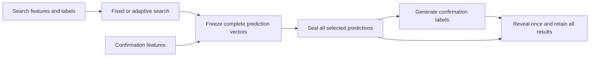

# Freeze the prediction before opening confirmation labels

**Implementation reviewed and prepared; no canonical regression outcomes yet.** This
standalone interface tests one information boundary: choosing a prediction
before its confirmation labels become available. It is separate from the
completed financial studies and does not supply p-values for their IC results.
The [versioned plan](sealed-confirmation-plan-v1.md) defines the exact finite
synthetic regression and its publication gate.

An adaptive search can propose candidates, inspect search feedback, fit their
direction and select a winner. The confirmation step then answers a different
question about that already chosen prediction. If it can affect which candidate,
direction or observations are selected, it is another search step.



The implementation receives no confirmation labels until the reveal call. The
synthetic runner goes further: it does not generate them until both correct
searches have finished and their full prediction vectors are sealed. Search
receives its own feedback capability, without the confirmation owner, seed or
random generator. This is a small API and execution-order boundary, not a
sandbox against hostile Python introspection. Saved access records document
the instrumented execution; they do not prove that an arbitrary caller never
obtained labels elsewhere.

The small API can be used independently of the regression driver:

```python
from alpha_research_rl.sealed_confirmation import ConfirmationBatch, freeze_prediction

batch = ConfirmationBatch(["proposal-a"])
batch.add(freeze_prediction(
    "proposal-a", [1, 1, 1, 1, 1], {"origin": "handcrafted arithmetic example"}
))
batch.seal()
# These are handpicked example labels, not simulated calibration evidence.
report = batch.reveal([1, 1, 1, 1, 1])
statistic = report["results"][0]["confirmation"]
assert (statistic["p_numerator"], statistic["p_denominator"]) == (1, 32)
```

The batch cannot accept another candidate after sealing or another reveal after
an attempt. A malformed reveal or declared confirmation-access record enters
permanent `FAILED` state. That prevents a caught input error from quietly
restoring a supposedly clean one-shot evaluation. It cannot prevent a caller
from making an entirely new object or using labels outside the interface;
the runner's durable one-run record supplies its separate execution boundary.

## Why the order changes the answer

Consider five independent fair-sign labels and the fixed prediction
`[+1, +1, +1, +1, +1]`. Predicting all five correctly has probability `1/32`.
Its one-sided exact p-value is `.03125`, so it rejects at level `.05`.

Now choose between that vector and its negative **after reading the same five
labels**. Either all-positive or all-negative labels produce five matches.
Those disjoint events have combined probability `2/32 = .0625`. Applying the
same `.03125` p-value to the fitted direction conceals that selection step.
The formula's arithmetic is unchanged; the conditions that justified it failed.

The deliberately faulty controls expose this distinction. They retain their
numbers as invalid diagnostic calculations and their pre-freeze accesses as
structural witnesses. A fault does not become valid merely because one finite
simulation fails to show an unusually high rejection count.

## Exact scope of the calculation

For a frozen vector with `M` nonzero predictions and `K` matches, the test uses

\[
p = 2^{-M}\sum_{j=K}^{M}\binom{M}{j}.
\]

The required null is strong and explicit: conditional on all search information,
confirmation features and frozen choices, active confirmation labels are
independent fair signs. Under that law, `K` is binomial even if the preceding
search was adaptive. Abstention and direction must also be fixed in advance.
For `M=0`, the result is `p=1`, with accuracy unavailable. Execution errors are
failures, never zero matches or silent non-rejections.

The helper computes exact integer/rational quantities and cannot establish that
its inputs satisfy this law. Ordinary classification labels need not be fair
conditional on their features. Overlapping financial returns do not satisfy
this synthetic label contract simply because predictions were frozen.

| Evidence | What it checks | What it does not establish |
| --- | --- | --- |
| Lifecycle and access tests | The implemented interface rejects late additions, repeated reveal and declared pre-freeze confirmation feedback | Isolation from undisclosed external label access |
| Exhaustive small cases | Binomial arithmetic, boundary inclusion, abstention and the sign-selection counterexample | Real-data assumptions |
| Frozen finite synthetic bank | The specified implementation's observed null behavior and known-signal power under its declared generator | A new statistical theorem, market significance or general agent competence |
| Known planted oracle | An evaluator that always returns no discovery fails the power check | That the search procedure learned the oracle |

## Reading the planned regression

The finite library contains 64 parity functions of six binary features. The
fixed and adaptive procedures each spend 32 search requests, including
duplicates. Both complete before confirmation labels are generated. The planned
bank contains 512 null panels and 128 planted panels, each with 256 confirmation
observations. Shared panels are matched comparisons, not additional independent
replications.

The pre-outcome arithmetic gives a rejection threshold of **142 matches**,
an exact single-panel null rejection probability approximately **.045656**,
and an upper calibration count of **37 out of 512** for each correct procedure.
The known planted oracle's lower check is **128 out of 128**. These are three
predeclared diagnostic checks sharing a total ideal-law false-alarm allowance
of `.01`; they are not a `.01` financial significance threshold or a claim of
familywise discovery control for all tested candidates. Exact fractions and
the finite decision rule belong to the frozen contract.

The one-request orientation-only fault has exact naive null rejection
probability about **.091312**. Its chance of exceeding 37 rejections over 512
ideal panels is about **.925587**, so an empirical miss is possible and must
remain visible. The more extensive selection-and-orientation faults have
correlated candidates; the report must not pretend their rate follows an
independent-candidate maximum formula.

Adaptive reuse is an established statistical problem; see
[Dwork et al. on generalization and holdout reuse](https://proceedings.neurips.cc/paper_files/paper/2015/file/bad5f33780c42f2588878a9d07405083-Paper.pdf)
and [Blum and Hardt's Ladder](https://proceedings.mlr.press/v37/blum15.pdf).
This implementation uses independent, one-shot confirmation. It does not
implement those algorithms or inherit their guarantees.

The final combined core, driver and independent suite passed **111 tests in
3.34 seconds on root**, with Ruff clean. One symbolic-link fixture was skipped
because this Windows host does not permit creating that test link. The
[audit record](audits/sealed-confirmation-review-v1.md) preserves findings and
review scope. Metadata-only preparation completed with **zero panel generations**;
the public-byte gate and canonical execution remain pending.
